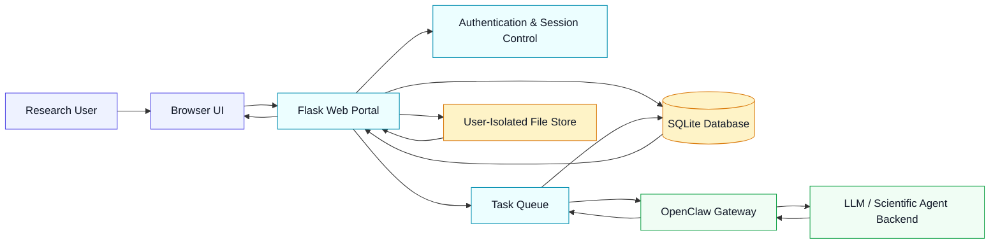
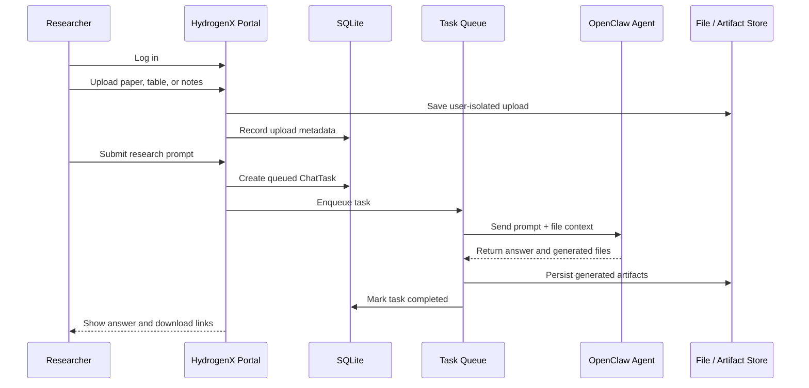

<div align="center">

# HydrogenX / Hydrogen Chat

### A secure multi-user web portal for AI-driven hydrogen research assistants

[](#quick-start)
[](#system-architecture)
[](#openclaw-integration)
[](#data-and-security)
[](#features)

**HydrogenX is an AI4S-oriented research assistant portal designed for hydrogen energy research.**  
It connects a browser-based scientific workspace with an OpenClaw-powered backend assistant, enabling user-isolated conversations, file-grounded task execution, generated artifact management, and queue-based multi-user access.

<br />

**Research Assistant · AI for Science · Hydrogen Energy · Multi-Agent Systems · OpenClaw Gateway**

</div>

---

## Overview

Hydrogen Chat is the web-facing component of the HydrogenX research assistant ecosystem. It is designed as a lightweight but practical portal for deploying an AI scientific assistant in a real research workflow.

The system follows a backend-proxy architecture: users interact with a Flask web application, while OpenClaw and the underlying model gateway remain hidden behind the server. This design makes it easier to support authenticated access, per-user session isolation, task queuing, uploaded-file grounding, and controlled file downloads.

> **Design goal:** provide a usable, auditable, and extensible research assistant interface for hydrogen-domain AI4S tasks, rather than a single-turn chatbot demo.

---

## Key Capabilities

<table>
<tr>
<td width="50%">

### Research-Oriented Chat

- Hydrogen assistant interface powered by OpenClaw
- Agent selection through configurable `agent_id`
- Backend-owned gateway token and model endpoint
- Per-user `x-openclaw-session-key`
- Stable user label generation for reproducible sessions

</td>
<td width="50%">

### Multi-User Portal

- User registration, login, logout
- Password hashing with Werkzeug
- Flask-Login session control
- User-level isolation for tasks, uploads, and artifacts
- SQLite-backed persistence for lightweight deployment

</td>
</tr>
<tr>
<td width="50%">

### File-Grounded Assistance

- User file upload support
- Uploaded files can be bound to specific chat tasks
- Text files can be automatically extracted into assistant context
- Per-user storage isolation
- Download endpoint for uploaded files

</td>
<td width="50%">

### Generated Artifacts

- Captures OpenClaw-generated file links
- Stores generated artifact metadata
- User-isolated artifact downloads
- MIME type, file size, SHA-256, and source URL tracking
- Ready for paper figures, reports, logs, and generated outputs

</td>
</tr>
<tr>
<td width="50%">

### Queue-Based Execution

- In-process dispatcher with thread pool
- Task states: `queued`, `running`, `completed`, `failed`
- Configurable concurrency via `OPENCLAW_MAX_CONCURRENT`
- Better handling for concurrent users
- Clear error state tracking

</td>
<td width="50%">

### Gateway Robustness

- Retry on transient gateway failures
- Separate connect and read timeouts
- Diagnostics for 401, 403, 404, 502, 503, and 504 responses
- Health check endpoint
- Gateway availability monitoring hooks

</td>
</tr>
</table>

---

## System Architecture



The browser never calls OpenClaw directly. Instead, the Flask backend owns the gateway credentials and creates a stable, user-specific OpenClaw session key for each authenticated user.

---

## Why HydrogenX?

Hydrogen energy research requires repeated literature synthesis, experimental data interpretation, catalyst comparison, figure generation, and long-horizon reasoning across heterogeneous sources. A single model call is usually not enough for this workflow.

HydrogenX is motivated by an AI4S agent design philosophy:

- **Grounded scientific interaction:** uploaded documents and generated files are attached to concrete tasks.
- **Traceable task execution:** every chat task has a stored state, prompt, response, timestamps, errors, uploads, and artifacts.
- **User-isolated research memory:** each user receives a separate assistant session, file namespace, and task history.
- **Extensible agent backend:** the portal can route requests to OpenClaw agents such as `main` or `hydrogen`.
- **Deployment-oriented design:** the project is built as a practical web portal, not only a local notebook prototype.

---

## Project Structure

```text
Hydrogen_Chat/
├── app/
│   ├── __init__.py                  # Flask app factory and global registration
│   ├── config.py                    # Runtime configuration and OpenClaw settings
│   ├── extensions.py                # SQLAlchemy, Flask-Login, CSRF
│   ├── models.py                    # User, ChatTask, UploadedFile, GeneratedArtifact
│   ├── blueprints/
│   │   ├── api.py                   # Task, upload, artifact, and queue APIs
│   │   ├── auth.py                  # Login, registration, logout
│   │   └── dashboard.py             # Landing page and workspace routes
│   ├── services/
│   │   ├── openclaw_client.py       # Backend OpenClaw request client
│   │   ├── task_queue.py            # Lightweight in-process task queue
│   │   ├── upload_service.py        # User upload storage and extraction
│   │   └── artifact_service.py      # Generated artifact capture and download
│   ├── static/
│   │   ├── css/style.css            # Custom portal styling
│   │   └── js/app.js                # Frontend task and upload interaction
│   └── templates/
│       ├── landing.html             # Public landing page
│       ├── base.html                # Shared layout
│       ├── auth/
│       └── dashboard/
├── instance/
│   ├── uploads/                     # Runtime user uploads, ignored by Git
│   └── artifacts/                   # Runtime generated files, ignored by Git
├── .env.example
├── requirements.txt
├── run.py
└── README.md
```

> The exact runtime files under `instance/` should not be committed to the repository.

---

## Quick Start

### 1. Clone the repository

```bash
git clone https://github.com/yy13213/Hydrogen_Chat.git
cd Hydrogen_Chat
```

### 2. Create a Python environment

```bash
python -m venv .venv
source .venv/bin/activate
pip install -r requirements.txt
```

For Windows PowerShell:

```powershell
python -m venv .venv
.venv\Scripts\Activate.ps1
pip install -r requirements.txt
```

### 3. Configure environment variables

```bash
cp .env.example .env
```

Edit `.env`:

```env
SECRET_KEY=replace-with-a-random-secret
DATABASE_URL=sqlite:///openclaw_webapp.db

APP_BRAND=HydrogenX

OPENCLAW_BASE_URL=http://127.0.0.1:18789
OPENCLAW_GATEWAY_TOKEN=replace-with-your-openclaw-gateway-token
OPENCLAW_DEFAULT_AGENT=main
OPENCLAW_ALLOWED_AGENTS=main,hydrogen
OPENCLAW_MODEL=openclaw

OPENCLAW_MAX_CONCURRENT=4
OPENCLAW_TIMEOUT=180
OPENCLAW_CONNECT_TIMEOUT=10
OPENCLAW_READ_TIMEOUT=180
OPENCLAW_RETRY_TIMES=2
OPENCLAW_RETRY_BACKOFF=1.0

OPENCLAW_UPLOADS_DIR=instance/uploads
OPENCLAW_ARTIFACTS_DIR=instance/artifacts
OPENCLAW_MAX_UPLOAD_MB=20
```

> For public repositories and shared deployments, keep gateway tokens in environment variables rather than hard-coding them in source files.

### 4. Initialize the database

```bash
flask --app run.py init-db
```

### 5. Start the portal

```bash
python run.py
```

Then open:

```text
http://127.0.0.1:5000
```

---

## OpenClaw Integration

Hydrogen Chat is designed to work with an OpenClaw gateway running locally or on a protected backend server.

A typical local gateway target is:

```text
http://127.0.0.1:18789/v1/responses
```

The backend sends requests similar to:

```bash
curl -X POST http://127.0.0.1:18789/v1/responses \
  -H "Authorization: Bearer <OPENCLAW_GATEWAY_TOKEN>" \
  -H "Content-Type: application/json" \
  -H "x-openclaw-agent-id: main" \
  -H "x-openclaw-session-key: web:user:demo001" \
  -d '{
    "model": "openclaw",
    "input": "Summarize recent MgH2 dehydrogenation catalyst trends.",
    "stream": false,
    "user": "web-user-demo001"
  }'
```

Before launching the web portal, check whether the gateway is listening:

```bash
ss -lntp | grep 18789
```

Optional systemd user-service workflow:

```bash
systemctl --user daemon-reload
systemctl --user restart openclaw-gateway.service
systemctl --user status openclaw-gateway.service
```

---

## API Sketch

| Method | Endpoint | Description |
|---|---|---|
| `GET` | `/healthz` | Portal health check |
| `POST` | `/auth/register` | Register a new user |
| `POST` | `/auth/login` | Log in |
| `GET` | `/auth/logout` | Log out |
| `GET` | `/workspace` | Main authenticated workspace |
| `GET` | `/api/tasks` | List current user tasks |
| `POST` | `/api/tasks` | Create a new assistant task |
| `GET` | `/api/tasks/<task_id>` | Get a task status and result |
| `POST` | `/api/uploads` | Upload a user file |
| `GET` | `/api/uploads` | List current user uploads |
| `GET` | `/api/uploads/<upload_id>/download` | Download an uploaded file |
| `GET` | `/api/artifacts` | List generated artifacts |
| `GET` | `/api/artifacts/<artifact_id>/download` | Download a generated artifact |
| `GET` | `/api/system/queue` | Inspect queue status |

---

## Data and Security

Hydrogen Chat includes several practical safeguards for research use:

- Passwords are stored as Werkzeug password hashes.
- Flask-Login protects authenticated routes.
- CSRF protection is enabled for forms and JSON POST requests.
- Users can only access their own tasks, uploads, and generated artifacts.
- The browser does not receive the OpenClaw gateway token.
- Uploads and generated artifacts are stored under configurable server-side directories.
- Each task records timestamps, status, errors, uploaded files, and generated artifacts.

Recommended production upgrades:

- Replace SQLite with PostgreSQL.
- Replace the in-process queue with Redis + Celery or RQ.
- Run behind Nginx with HTTPS.
- Add per-user quotas and rate limiting.
- Add admin metrics and audit logs.
- Use object storage for large generated artifacts.

---

## Typical Research Workflow



---

## Example Prompts

Hydrogen Chat can be used for research tasks such as:

```text
Summarize the dehydrogenation performance trends of MgH2-based catalysts from the uploaded paper.
```

```text
Compare onset dehydrogenation temperature, activation energy, and catalyst composition across these uploaded studies.
```

```text
Generate a publication-style figure and caption for the extracted hydrogen storage dataset.
```

```text
Review the manuscript section and identify possible hallucinated claims or unsupported citations.
```

```text
Design an AI4S multi-agent workflow for literature review, catalyst screening, and figure generation.
```

---

## Roadmap

- [x] Multi-user authentication
- [x] OpenClaw backend proxy
- [x] User-isolated task history
- [x] Queue-based request execution
- [x] File upload support
- [x] Generated artifact download links
- [x] Gateway diagnostics and retry logic
- [ ] Streaming response display
- [ ] Redis-backed distributed task queue
- [ ] Admin dashboard and usage analytics
- [ ] Per-user quotas and rate limiting
- [ ] Paper-level citation verification module
- [ ] Long-horizon memory and project workspace
- [ ] PostgreSQL production deployment template
- [ ] Docker Compose deployment

---

## Research Context

HydrogenX is inspired by the broader direction of AI for Science and multi-agent scientific discovery. The project is designed around the observation that hydrogen research workflows require more than direct model completion: they require retrieval, document grounding, tool execution, artifact generation, skepticism, and persistent task states.

This repository focuses on the **portal and deployment layer** of that vision. It can serve as the user-facing entry point for future HydrogenX modules, including:

- literature-grounded hydrogen research assistant;
- autonomous chart and figure generation;
- multi-agent research planning;
- catalyst data analysis and machine learning workflows;
- paper review, claim checking, and citation verification;
- long-horizon scientific project memory.

---

## Troubleshooting

### 1. `502`, `503`, or `504` from the assistant

Possible reasons:

- OpenClaw gateway is not running.
- Upstream model backend is unavailable.
- Gateway token is incorrect.
- The configured `agent_id` is not allowed.
- The request is too long or times out.
- Concurrent requests exceed gateway capacity.

Check:

```bash
ss -lntp | grep 18789
systemctl --user status openclaw-gateway.service
```

### 2. Login works but tasks stay queued

Check whether the queue worker is started with the Flask app and whether `OPENCLAW_MAX_CONCURRENT` is set correctly.

### 3. Uploaded files are not used by the assistant

Confirm that the frontend sends `upload_ids` when creating a task, and that the file type can be extracted as text.

### 4. Generated files cannot be downloaded

Check whether `OPENCLAW_ARTIFACTS_DIR` exists and whether the Flask process has read/write permission.

---

## Citation

If this project is useful for your research, please consider citing the related HydrogenX work once the paper is publicly available.

```bibtex
@misc{hydrogenx2026,
  title        = {HydrogenX: A Multi-Agent AI4S Framework for Hydrogen Research},
  author       = {Yang, Yang and collaborators},
  year         = {2026},
  note         = {Manuscript in preparation},
  url          = {https://github.com/yy13213/Hydrogen_Chat}
}
```

---

## License

Please add a license file before public release. Recommended options:

- **MIT** for a permissive research prototype;
- **Apache-2.0** if patent grants are important;
- **GPL-3.0** if derivative projects should remain open-source.

---

## Acknowledgements

This project is part of the HydrogenX effort toward AI-assisted hydrogen energy research. It builds on the practical needs of scientific workflows: authenticated access, file-grounded reasoning, reproducible task states, and downloadable research artifacts.

<div align="center">

**HydrogenX: toward reliable, extensible, and research-grounded AI assistants for hydrogen science.**

</div>

